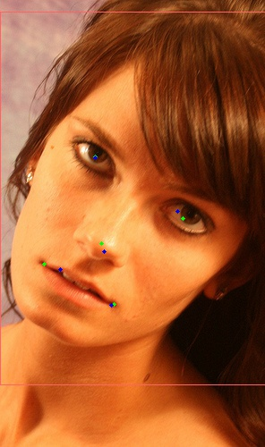
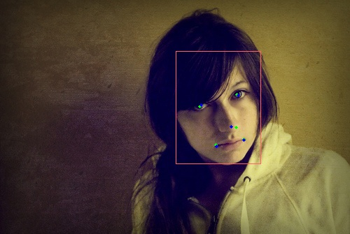

# Face-Alignment
Face alignment with 5 points (nose, center of both eyes, both corners of mouth), this project include model training, landmarks detection and alignment based on the detected landmarks and a 224 by 224 symmetric 5 points facial template.

### Prerequisites
* Anaconda 3.6
* dlib
* opencv (conda)

### Examples

